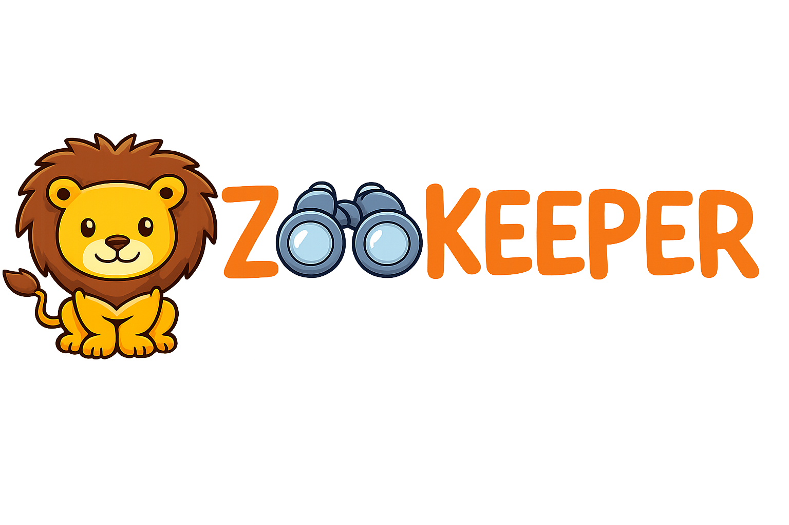

<p align="center">
  
</p>

# CLAUDE.md

This file provides guidance to Claude Code (claude.ai/code) when working with code in this repository.

## Build Commands

```bash
npm run dev         # Start Vite development server (http://localhost:5173)
npm run dev:api     # Start Wrangler Pages dev server with D1/R2
npm run dev:full    # Build + start full stack locally
npm run build       # TypeScript check + production build
npm run lint        # Run ESLint
npm run preview     # Preview production build
npm run deploy      # Build and deploy to Cloudflare Pages
npm run db:create   # Create D1 database
npm run db:migrate  # Apply D1 migrations (production)
npm run db:migrate:local  # Apply D1 migrations (local)
```

## Architecture Overview

Zookeeper is a mobile-first PWA for tracking zoo animal sightings - "Pokédex for real zoo animals".

### Tech Stack
- **Frontend**: React 19 + TypeScript + Vite
- **Styling**: Tailwind CSS v4 with custom design tokens
- **State**: Zustand for global state
- **Database**: Cloudflare D1 (SQLite at the edge)
- **Photo Storage**: Cloudflare R2 (S3-compatible)
- **API**: Cloudflare Pages Functions
- **Auth**: Google OAuth 2.0 with JWT cookies
- **Data Fetching**: TanStack Query
- **LLM**: OpenRouter API (Gemini 2.0 Flash for vision + text)

### Directory Structure
```
zookeeper/
├── src/                    # Frontend (React)
│   ├── components/         # Reusable React components (BottomNav)
│   ├── lib/                # Core libraries
│   │   ├── api.ts          # API client with auth handling
│   │   ├── openrouter.ts   # LLM API client
│   │   ├── colors.ts       # Design tokens
│   │   └── utils.ts        # Helper functions
│   ├── pages/              # Route components
│   ├── services/           # API service layer
│   ├── stores/             # Zustand state (useStore.ts)
│   └── types/              # TypeScript interfaces
├── functions/              # Cloudflare Pages Functions (API)
│   ├── api/
│   │   ├── auth/           # Google OAuth endpoints
│   │   ├── zoos/           # Zoo CRUD endpoints
│   │   ├── visits/         # Visit tracking endpoints
│   │   ├── sightings.ts    # Sightings endpoint
│   │   └── stats.ts        # User statistics endpoint
│   ├── _middleware.ts      # Auth middleware
│   └── lib/                # Shared utilities
│       ├── auth.ts         # JWT utilities
│       └── db.ts           # D1 query helpers
├── migrations/             # D1 database migrations
│   └── 0001_initial.sql    # Initial schema
└── wrangler.toml           # Cloudflare Pages config
```

### Key Patterns

**API Layer**: All data operations go through `src/services/` which call the backend API at `/api/*`. The API is served by Cloudflare Pages Functions.

**Authentication**: Google OAuth with JWT tokens stored in httpOnly cookies. The `functions/_middleware.ts` protects all `/api/*` routes except auth endpoints.

**Data Ownership**:
- **Zoos & Animals**: Global (shared by all users)
- **Visits & Sightings**: Private (scoped to user_id)

**Zoo Ordering**: Zoos are ordered by: nearby (within 100km) → visited by user → alphabetical.

**Design Tokens**: Custom colors defined in `src/lib/colors.ts` - forest green, savanna gold, terracotta. Fonts: Fredoka (display) + Nunito (body).

**Mobile-First**: All pages designed for mobile with bottom navigation (`BottomNav` component).

### Environment Variables

**Frontend** (`.env.local`):
- `VITE_OPENROUTER_API_KEY` - Required for AI features

**Backend** (`wrangler.toml` + secrets):
- `GOOGLE_CLIENT_ID` - Google OAuth client ID (in wrangler.toml)
- `GOOGLE_CLIENT_SECRET` - Google OAuth secret (via `wrangler secret put`)
- `JWT_SECRET` - Random 32+ char string (via `wrangler secret put`)

### Cloudflare Setup

1. Create D1 database: `npm run db:create`
2. Apply migrations: `npm run db:migrate`
3. Create R2 bucket: `wrangler r2 bucket create zookeeper-photos`
4. Add secrets:
   - `wrangler secret put GOOGLE_CLIENT_SECRET`
   - `wrangler secret put JWT_SECRET`
5. Deploy: `npm run deploy`

## Screenshots with Playwright

Use the Playwright MCP tools to capture screenshots of the app:

```bash
# Navigate to a page
mcp__plugin_playwright_playwright__browser_navigate url="http://localhost:5173"

# Take a screenshot
mcp__plugin_playwright_playwright__browser_take_screenshot filename="my-screenshot.png"
```

Screenshots are saved to `.playwright-mcp/` (gitignored). Move important screenshots to `blogs/` with sequential numbering.

## Blog Documentation

After completing a major feature, create a blog entry in `blogs/`:

1. Check existing files in `blogs/` to find the next available number
2. Name files sequentially: `0001blog.md`, `0002screenshot.png`, `0003screenshot.png`, etc.
3. All blog content and screenshots share the same numbering sequence
4. Blog posts should document what was built, design decisions, and technical notes
